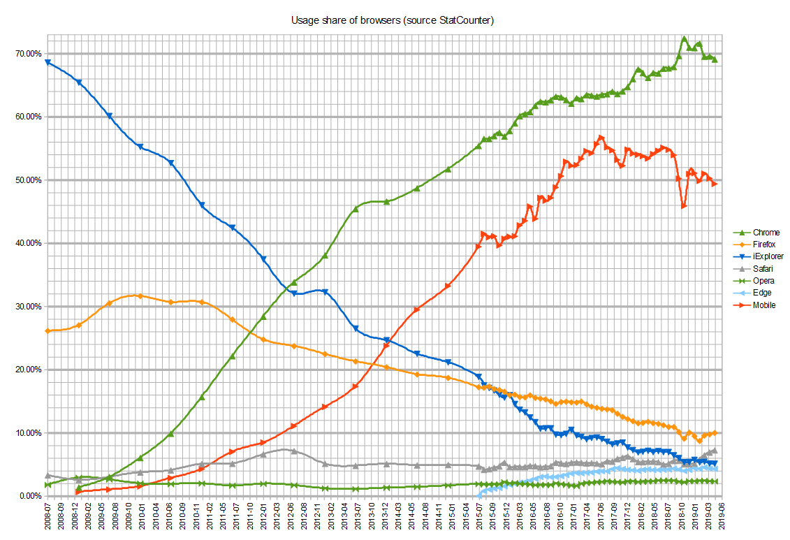

## Browser & its Engine

### 1. Browser and Engine

###### Now

```
+------------+------------+------------+
|  Browser   |  Engine    |  Inc       |
+------------+------------+------------+
|  Firefox   |  Gecko     |  Mozilla   |
|  Safari    |  WebKit    |  Apple     |
|  Chrome    |  Blink     |  Google    |
|  Edge      |  Blink     |  Microsoft |
|  IE        |  Trident   |  Microsoft |
|  Opera     |  Blink     |  Opera     |
+------------+------------+------------+
```


###### Early

```
+------------+------------+------------+
|  Browser   |  Engine    |  Inc       |
+------------+------------+------------+
|  Firefox   |  Gecko     |  Mozilla   |
|  Safari    |  WebKit    |  Apple     |
|  Chrome    |  WebKit    |  Google    |
|  Edge      |  EdgeHTML  |  Microsoft |
|  IE        |  Trident   |  Microsoft |
|  Opera     |  Presto    |  Opera     |
+------------+------------+------------+
```


#### Timeline

```
|
- 1990年代，Netscape占领着浏览器市场
|
- 1996，Opera公开发布版本2.1.0  
|
- 2001/6/25, Apple开始研发WebKit 
|
- 2003，Internet Explorer占领着95%的市场份额（击败了Netscape；赢得了第一次浏览器大战）
|
- 2004，Firefox发布
|
- 2008年Google Chrome发布
| 
- 2013/2/12，Opera宣布弃用他们自己Presto布局引擎，使用WebKit；在这之前使用 Presto layout engine
| 
- 2013/4/3 Google宣布使用Blink，在Chrome版本28中开始使用；在这之前使用WebKit
| 
- 2013/4/3 Opera追随Google脚步，宣布使用Blink
|
- 2014-2019 Edge use EdgeHTML（a fork of Trident）、Chakra（JavaScript engine）
|
- 2019-至今 Edge使用Blink
|
```



#### Internet Explorer

```
+------------+---------------------+------------------------------------------------+
|  Version   |  Engine             |  Feature                                       |
+------------+---------------------+------------------------------------------------+
|  IE6       |  Trident            |                                                |  
|  IE7       |  Trident            |                                                |  
|  IE8       |  Trident4.0         |  CSS 2.1                                       |    
|  IE9       |  Trident5.0 Chakra  |  HTML5 CSS3 SVG                                |
|  IE10      |  Trident6.0 Chakra  |  HTML5 CSS3 SVG                                |
|  IE11      |  Trident7.0 Chakra  |  HTML5 CSS3 SVG                                |
+------------+---------------------+------------------------------------------------+
```

#### 国内浏览器

```
+---------------+---------------------+---------------------------------------------+
|  Browser      |  Engine             |  Feature                                    |
+---------------+---------------------+---------------------------------------------+
|  360安全浏览器  |  Blink Trident      |  默认是Blink，兼容模式是Trident                |  
|  360极速浏览器  |  Blink Trident      |  默认是Blink，兼容模式是Trident                |
|  搜狗浏览器     |  WebKit Trident     |  默认是WebKit，兼容模式是Trident               |  
|  QQ浏览器      | WebKit Trident      |   默认是WebKit，兼容模式是Trident              | 
|  遨游浏览器     | WebKit Trident      |   默认是WebKit，兼容模式是Trident              |  
|  UC浏览器      |  Blink Trident      |  默认是Blink，兼容模式是Trident                |
|  猎豹浏览器     | WebKit Trident      |   默认是WebKit，兼容模式是Trident              |  
+---------------+---------------------+----------------------------------------------+
```

### 2. Engine relationship

```
    +-------+  
    | Gecko |    
    +-------+	
                                         --------   
                                        |  PCRE  |    
                                        ^--------   
                    ----------------   / (fork)
                   | JavaScriptCore |       
                    ----------------   \ (fork)  
                                         ---------   
                                        |  KJS    |   
    +---------+  /                       ---------   \   -------
    |  WebKit |                          ---------      |  KDE  |
    +---------+  \                      |  KHTML  |  /   -------
                                       ^ --------- 
                    ----------------  / (fork)
                   |    WebCore     |    
                  ^ ----------------    			
    +---------+  /(fork)
    |  Blink  |    
    +---------+							                 
		
				    
    +---------+  
    | Trident |    
    +---------+
		 ^
		 |(fork)
    +----------+  
    | EdgeHTML |    
    +----------+
     
```

### 3. 现代浏览器和非现代浏览器
现代浏览器指该浏览器能够理解和支持HTML和XHTML，Cascading Style Sheets（CSS），ECMAScript及W3C Document Object Model（DOM）标准。

### 4. 浏览器支持范围

|    浏览器           |     Web         |    Web Admin    |    H5
|:------------- |:---------------| :-------------|:------------
| Chrome        |     兼容         |     兼容      |兼容
| Firefox       |     兼容         |     兼容      |兼容
| Safari        |     兼容         |     兼容      |兼容
| Edge          |     兼容		    |     兼容       |兼容
| 其它       | 1. 一般情况兼容IE8/IE9/IE10 <br> 2. 特殊情况兼容IE6及以上（若有其它适配需求，需说明） | 1. 套模板时：兼容情况同WEB<br> 2. 使用前端框架时（Vue、React、Angular），只兼容现代浏览器 | 兼容手机默认浏览器


### 5. Reference
* [Timeline of web browsers](https://en.wikipedia.org/wiki/Timeline_of_web_browsers)
* [Internet Explorer](https://en.wikipedia.org/wiki/Internet_Explorer)
* [List of web browsers](https://en.wikipedia.org/wiki/List_of_web_browsers#WebKit-based)
* [A Modern Browser](https://blogs.msdn.microsoft.com/tims/2011/02/15/a-modern-browser/)
* [IE9是"现代浏览器"吗?](https://36kr.com/p/15382)


